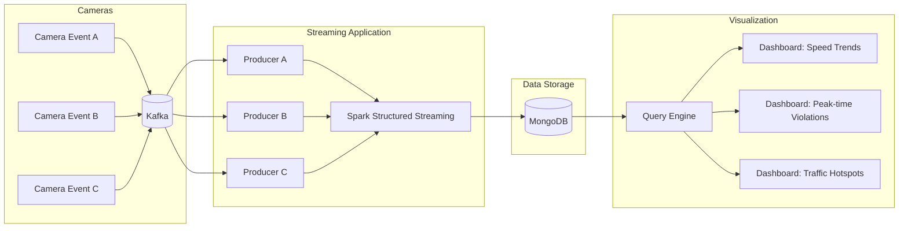
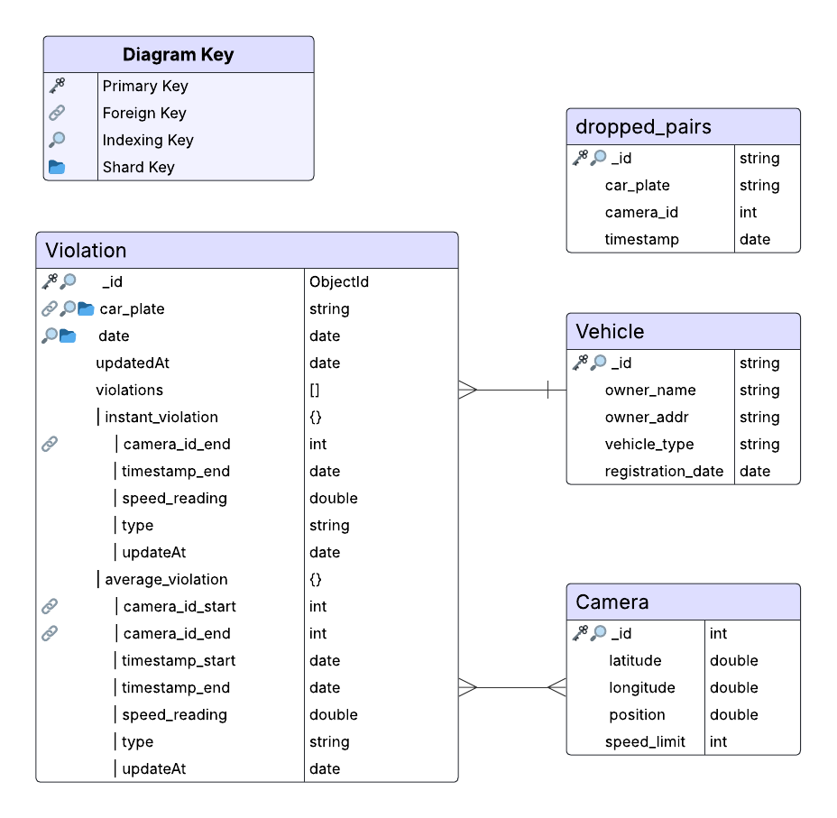

# AwAS Malaysia: Big Data Streaming for Traffic Violation Detection

## 🚦 Project Overview
AwAS Malaysia is a real-time big data streaming system designed to detect and analyze traffic violations from camera feeds.  
The system processes continuous streams of vehicle data, detects speed violations, and stores results for visualization and decision-making.

**Key Features:**
- Real-time data ingestion from multiple traffic cameras
- Stream–stream joins with watermarking using **Apache Spark Structured Streaming**
- Data storage and schema design with **MongoDB**
- Interactive dashboards for speed trends, peak-time violations, and traffic hotspots
- Scalable and fault-tolerant design using **Apache Kafka**

---

## 🏗️ System Architecture


- **Kafka producers** simulate multiple camera streams.  
- **Spark Structured Streaming** processes events, performs joins, and applies watermarking.  
- **MongoDB** stores processed results.  
- **Dashboards** query MongoDB for visualization.

---

## 📊 Streaming Pipeline

Kafka Producers simulate events from 3 traffic cameras (`camera_event_a`, `camera_event_b`, `camera_event_c`), each containing:

- `event_id`
- `batch_id`
- `car_plate`
- `camera_id`
- `timestamp`
- `speed_reading`

**Spark Structured Streaming:**

- Consumes events from Kafka topics
- Applies stream–stream joins with watermarking
-  Detects violations (e.g., instantaneous overspeeding, average overspeeding between cameras)

**MongoDB stores:**

- Raw events (for auditing)
- Processed violations (for dashboards)

---

## 🗄️ Database Schema


---

## 📈 Data Visualization

The visualization dashboards provide actionable insights on traffic violations and driving behavior.

### 1️⃣ Speed Trends and Violation Graphs

For each camera, two real-time graphs are plotted:

- **Number of Violations vs Arrival Time**
- **Vehicle Speed vs Arrival Time**

**Features:**

- X-axis: Vehicle arrival time (minute-level granularity)
- Y-axis: Number of violations or vehicle speed
- Color-coded lines:
  - Blue = Instantaneous violations/speeds
  - Green = Average segment violations/speeds
  - Dotted lines = 90th percentile speeds
- Annotations: Peak, Low, and shaded regions indicate anomalies and traffic risk patterns
- Insights: Detects driver behavior patterns, enforcement gaps, and critical time periods for intervention

### 2️⃣ Map of Camera Locations and Hotspots

- Interactive map showing traffic cameras and violations
- Hotspot detection: Cameras with more than 100 violations/hour are highlighted
- Popups display:
  - Hour
  - Violation count
  - Average exceeded speed
- Supports dynamic filtering by date and hour using an `ipywidgets` slider
- Enables authorities to:
  - Identify high-risk areas
  - Optimize camera placement
  - Allocate resources efficiently

---

## ⚙️ Getting Started

### Prerequisites

- Apache Kafka
- Apache Spark with Structured Streaming
- MongoDB
- Python 3.8+ (for Kafka producers and visualization utilities)

### Setup Instructions

1. **Clone the repository**

```bash
git clone https://github.com/<your-username>/AwAS-Malaysia.git
cd AwAS-Malaysia
```

2. **Start Kafka & MongoDB** (ensure both services are running)

3. **Run Kafka Producers to simulate camera events**
   
    Open each of the following Jupyter notebooks and run all cells to simulate camera events:
    
    - `producer_cam_a.ipynb`
    - `producer_cam_b.ipynb`
    - `producer_cam_c.ipynb`
    
    These notebooks simulate camera events and send them to the Kafka topics for processing.
   
4. **Run Spark Structured Streaming Job**

    Open the Jupyter notebook `data_design_streaming.ipynb` and run all cells.  
    This notebook processes the camera events from Kafka and stores the results in MongoDB.

5. **Visualize Data**

    Open the Jupyter notebook `data_visualisation.ipynb` and run all cells to generate real-time graphs and interactive maps.

---

## 📌 Project Status
✅ Kafka producers implemented for 3 cameras

✅ Spark Structured Streaming job with watermarking

✅ MongoDB schema designed for raw + processed data

✅ Real-time dashboards for speed trends, violations, and hotspot mapping

---

## 🚀 Future Work

The AwAS Malaysia project is designed with scalability in mind, but there are several potential improvements and extensions for future development:

- **Expand Camera Coverage:** Add more traffic cameras across different locations to improve data granularity and detection accuracy.
- **Enhanced Analytics:** Incorporate predictive analytics to anticipate traffic violations and congestion patterns.  
- **Real-Time Alerts:** Implement automated notifications to authorities for immediate intervention.  
- **Integration with IoT Devices:** Collect additional traffic and environmental data for richer insights.  
- **Scalability Improvements:** Optimize Kafka and Spark configurations to handle higher data volumes from more cameras.
